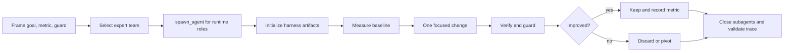

# Codex Harness Engineer

[](https://github.com/WhoJay0609/codex-harness-engineer-agent/actions/workflows/ci.yml)


**A Codex skill for turning agent work into reproducible, inspectable,
multi-agent engineering runs.**

Harness Engineer gives Codex a repo-native operating system: direct runtime
subagent teams, measurable improve/verify loops, typed trace artifacts,
mechanical gates, replay files, and explicit keep/discard decisions.

中文摘要：这是一个 Codex skill，用于把复杂工程任务组织成可复现、可验证、可回放
的 harness。它不是简单“多开智能体”，而是让目标、上下文、子智能体、工具调用、
指标、失败和终止状态都有证据。

## Why Star This

- **Direct runtime teams**: the main Codex orchestrator calls `spawn_agent`,
  assigns role-specific task cards, records runtime IDs, then closes or replaces
  subagents with lifecycle evidence.
- **Code Auto Research style loops**: baseline, one focused change, verify,
  guard, keep/discard, and repeat inside the foreground Codex session by
  default.
- **Trace-first artifacts**: every meaningful action lands in JSON/JSONL files
  that can be validated, replayed, queried, exported, and compared.
- **Skill-aware expert library**: generated expert roles map installed skills to
  bounded responsibilities instead of turning every subagent into a generic
  assistant.
- **Local-first validation**: no hosted service is required for the core checks;
  the repo ships self-evals and schema gates.

## 60-Second Demo

```bash
git clone https://github.com/WhoJay0609/codex-harness-engineer-agent.git
cd codex-harness-engineer-agent

python3 scripts/select_subagent_team.py \
  --task-class execution \
  --goal "improve a measurable repo score" \
  --scope src/

python3 scripts/run_harness_evals.py
python3 scripts/validate_harness_trace.py evals/cases/valid_direct_runtime_team
```

Example team plan output includes task cards for `Context Curator`, `Runner
Coordinator`, and `Verifier / Evidence Auditor`. In a live Codex session, the
main orchestrator creates those roles with `spawn_agent`, passes the returned
runtime IDs into `init_auto_harness.py`, and records terminal events with
`record_subagent_lifecycle.py`.

## Install As A Codex Skill

The repository root is the installable skill package root. Do not nest it under
an extra `skills/harness-engineer/` directory.

```bash
CODEX_HOME="${CODEX_HOME:-$HOME/.codex}"
mkdir -p "$CODEX_HOME/skills/harness-engineer"
rsync -a --delete \
  --exclude '.git/' \
  --exclude 'README.md' \
  --exclude '.gitignore' \
  --exclude '__pycache__/' \
  --exclude '*.pyc' \
  ./ "$CODEX_HOME/skills/harness-engineer/"
```

Invoke it in Codex with:

```text
$harness-engineer
```

or reference the installed entrypoint:

`$CODEX_HOME/skills/harness-engineer/SKILL.md`.

## Core Workflow



The main thread keeps the critical path: goal decomposition, context trimming,
integration, final verification, and artifact integrity. Subagents handle
parallel branches: reconnaissance, local implementation, independent
verification, failure analysis, and risk review.

## Direct Runtime Team

1. Select the smallest preset:

   ```bash
   python3 scripts/select_subagent_team.py \
     --task-class execution \
     --goal "improve the measured score" \
     --scope src/
   ```

2. In Codex, call `spawn_agent` once per task card.

3. Initialize the run with concrete runtime IDs returned by `spawn_agent`:

   ```bash
   python3 scripts/init_auto_harness.py \
     --run-dir runs/demo/001 \
     --goal "improve the measured score" \
     --scope src/ \
     --metric score \
     --direction higher \
     --verify "python3 scripts/score.py" \
     --guard "pytest -q" \
     --baseline-metric 0 \
     --runtime-subagent "Context Curator=<runtime_agent_id>" \
     --runtime-subagent "Verifier / Evidence Auditor=<runtime_agent_id>"
   ```

4. Replace every `<runtime_agent_id>` with a concrete ID returned by
   `spawn_agent`. Placeholders are intentionally rejected by the helpers and
   validator.

5. After subagents finish or are closed, record terminal lifecycle:

   ```bash
   python3 scripts/record_subagent_lifecycle.py \
     --run-dir runs/demo/001 \
     --event completed \
     --role "Verifier / Evidence Auditor" \
     --agent-id verifier-evidence-auditor \
     --stop-reason "verification completed with evidence"
   ```

## Auto Harness Loop

Foreground is the default. No detached process is created unless the run is
initialized with `--run-mode background` and launched through
`scripts/harness_runtime_ctl.py`.

```bash
python3 scripts/record_auto_iteration.py \
  --run-dir runs/demo/001 \
  --status keep \
  --metric 1.25 \
  --guard pass \
  --description "focused change improved the primary metric"

python3 scripts/run_auto_harness.py \
  --run-dir runs/demo/001 \
  --iteration-command "python3 scripts/propose_one_change.py" \
  --iterations 5
```

## Artifact Contract

A minimal harness run records:

```text
manifest.json
subagents.jsonl
skill_invocations.jsonl
events.jsonl
tool_calls.jsonl
failures.jsonl
metrics.json
summary.md
replay.md
```

Full auto-harness runs also include `auto_state.json`, `results.tsv`, and
`context.json`. See [docs/artifact-tour.md](docs/artifact-tour.md) and
[references/artifact-contract.md](references/artifact-contract.md).

## Repository Map

```text
SKILL.md                         # Codex skill entrypoint
agents/openai.yaml               # Skill metadata for agent installation
scripts/                         # Runtime helpers, validators, eval runner
references/                      # Artifact contracts and operating policies
evals/cases/                     # Good and bad trace fixtures
docs/                            # Public quickstart and launch docs
examples/                        # Copy-paste usage recipes
.github/                         # CI, issue templates, PR template
```

## Docs

- [Quickstart](docs/quickstart.md)
- [中文说明](docs/README.zh-CN.md)
- [Artifact Tour](docs/artifact-tour.md)
- [Concepts](docs/concepts.md)
- [Public Launch Checklist](docs/public-launch-checklist.md)
- [Maintenance Guide](references/maintenance-guide.md)
- [Team Formation Policy](references/team-formation-policy.md)
- [Subagent Runtime](references/subagent-runtime.md)

## Validation

Local strict validation:

```bash
python3 scripts/check_harness_consistency.py .
python3 scripts/run_harness_evals.py
python3 -m py_compile scripts/*.py
```

Portable CI validation:

```bash
python3 scripts/check_harness_consistency.py . --skip-environment-freshness
python3 scripts/run_harness_evals.py
python3 -m py_compile scripts/*.py
```

## Related Projects

- [leo-lilinxiao/codex-autoresearch](https://github.com/leo-lilinxiao/codex-autoresearch)
- [TheGreenCedar/codex-autoresearch](https://github.com/TheGreenCedar/codex-autoresearch)
- [karpathy/autoresearch](https://github.com/karpathy/autoresearch)
- [OpenAI Evals](https://github.com/openai/evals)
- [OpenHands](https://github.com/OpenHands/OpenHands)
- [SWE-agent](https://github.com/SWE-agent/SWE-agent)
- [LangGraph](https://github.com/langchain-ai/langgraph)
- [AgentOps](https://github.com/agentops-ai/agentops)

This repo borrows the measured-loop and traceability ideas while staying
Codex-native and file-based.

## Contributing

Contributions are welcome, especially:

- new eval fixtures that catch bad artifact contracts;
- smaller, clearer examples for real Codex workflows;
- docs that explain failure recovery and replacement subagents;
- portable validation improvements that do not depend on private paths.

Start with [CONTRIBUTING.md](CONTRIBUTING.md).

## License

No license file is currently present. Choose and add a license before broad
public reuse or external redistribution.

## Project Status

The repository is usable as a local Codex skill and includes regression evals.
The public launch surface is still evolving: screenshots, demo recordings, and a
license decision are intentionally left as release checklist items.
